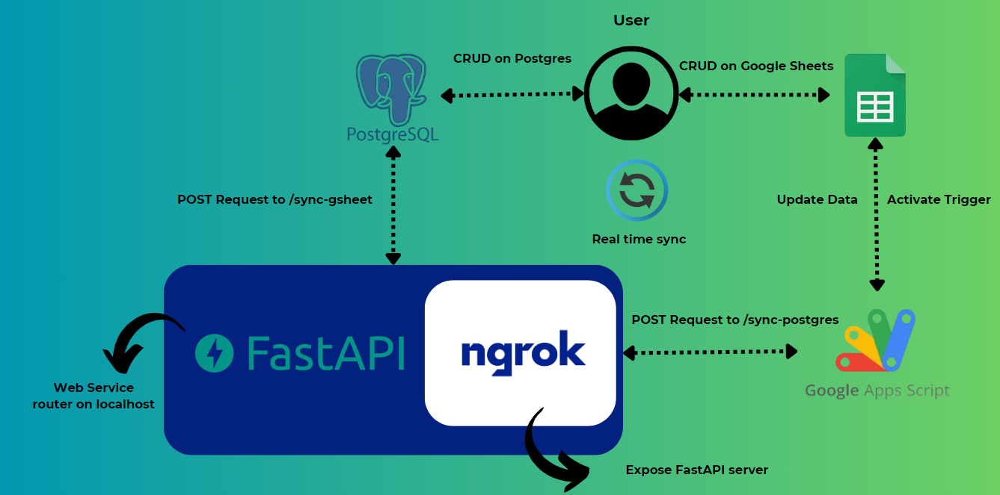

# GoogleSheets-Postgres Sync with FastAPI

## Approach


This project addresses the need for real-time synchronization between Google Sheets and PostgreSQL using FastAPI. The approach is designed to ensure that updates in Google Sheets and the PostgreSQL database are mirrored efficiently and automatically.

Key steps in the approach:
1. **Data Sync from Google Sheets to PostgreSQL**: A Google Apps Script trigger detects changes in the Google Sheet and automatically sends an HTTP POST request to the FastAPI `/sync_postgres` endpoint, which updates PostgreSQL with the modified data.
2. **Data Sync from PostgreSQL to Google Sheets**: Database triggers in PostgreSQL listen for changes. When changes are detected, they notify a FastAPI listener which triggers the `/sync_gsheet` endpoint to update the Google Sheet.
3. **Conflict Handling**: The project includes checks and logic to handle simultaneous updates, ensuring no data loss or inconsistencies. It checks the latest versions of the data from both sources and ensures proper conflict resolution.

I created a Google Apps Script trigger that detects edits in the Google Sheet and pushes these changes to the FastAPI server. Similarly, PostgreSQL uses database triggers to notify FastAPI of any data changes.

## Tech Stack Used

- **FastAPI**: The web framework used for building API endpoints for synchronization.
- **PostgreSQL**: The relational database used to store the synchronized data.
- **Google Sheets API**: To read/write data from Google Sheets.
- **Psycopg2**: For interaction with PostgreSQL using Python.
- **Ngrok**: For forwarding the local FastAPI server to the web to receive Google Sheets updates.
- **Docker**: For containerizing the application and making deployment easier.

## How Conflicts Are Handled

Conflicts can arise when:
- A user updates both Google Sheets and PostgreSQL at the same time.
- Google Sheets and the database contain different data at the time of synchronization.

To manage this, I:
- Compare the data in both sources to detect discrepancies.
- Use the following rules for conflict resolution:
  - If a record is present in the Google Sheet but missing in PostgreSQL, it is added to the database.
  - If a record exists in PostgreSQL but not in the Google Sheet, it is deleted from the database.
  - If a record exists in both but has different values, I update the Google Sheet with the latest version from PostgreSQL (or vice versa, based on the source of the update).

## How Synchronization Works

1. **Google Sheets to PostgreSQL**:
    - A Google Apps Script trigger is set to detect changes in the Google Sheet.
    - When a change occurs, the script makes a POST request to the `/sync_postgres` FastAPI endpoint.
    - The FastAPI application receives this request and updates the PostgreSQL database with the new data.

2. **PostgreSQL to Google Sheets**:
    - A trigger is set up in PostgreSQL to detect any data changes (insert/update/delete).
    - When a change occurs, PostgreSQL notifies the FastAPI listener via a channel.
    - FastAPI listens to these notifications and triggers the `/sync_gsheet` endpoint, which updates the Google Sheet with the new data.

## Dependencies

The project relies on the following dependencies:

- **FastAPI** for building APIs.
- **Psycopg2** for PostgreSQL interaction.
- **Google Sheets API** for managing Google Sheets.
- **Docker** (if containerizing).
- **Ngrok** for exposing the local FastAPI server to the internet.

All dependencies are listed in the `requirements.txt` file.

## How to Use

### Step 1: Clone the Repository
```bash
git clone https://github.com/your-username/gsheet-postgres-sync-fastapi.git
cd gsheet-postgres-sync-fastapi 
```

### Step 2: Install Dependencies

```bash
pip install -r requirements.txt
```
### Step 3: Set Up Environment Variables

Create a `.env` file in the project directory and configure the following variables:

```makefile
DB_HOST=your_postgres_host
DB_PORT=your_postgres_port
DB_NAME=your_postgres_db_name
DB_USER=your_postgres_user
DB_PASSWORD=your_postgres_password
GSHEET_ID=your_google_sheet_id
GSHEET_RANGE=your_google_sheet_range
```
### Step 4: Run FastAPI Server
```bash
uvicorn main:app --reload
```
### Step 5: Set Up Ngrok
If you're running locally and need to expose the server for Google Sheets integration, run:
```bash
ngrok http 8000
```
### Step 6: Set Up Google Apps Script

Copy the script provided in the `trigger.js` file into your Google Apps Script Editor.
Update the endpoint URL in the script to point to your Ngrok URL (or production URL).
Deploy the Google Apps Script and create an onEdit trigger to detect changes in the Google Sheet.

### Step 8: Test the Setup
Add a new row in Google Sheets and see it reflected in PostgreSQL.
Update or delete data in the PostgreSQL database and see it reflected in Google Sheets.
